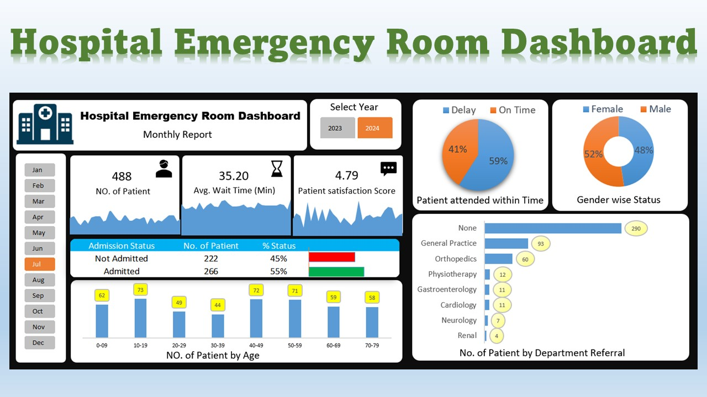

# 🏥 Hospital Emergency Room Dashboard

## 📊 Overview  
This interactive **Excel Dashboard** provides a detailed analysis of a hospital’s emergency room (ER) performance.  
It visualizes patient data including visits, wait times, satisfaction levels, admissions, and more — helping identify trends, improve efficiency, and enhance patient experience.

---

## 🧩 Dashboard Highlights  

### 1️⃣ Number of Patients  
- Total count of patients visiting the ER each day.  
- Displayed using an **area chart** to show daily or seasonal trends.

### 2️⃣ Average Wait Time  
- Shows the **average waiting time (in minutes)** before being attended by medical staff.  
- Visualized via an **area chart** to spot days with longer delays.

### 3️⃣ Patient Satisfaction Score  
- Daily **average satisfaction rating** to monitor service quality.  
- Area chart helps to identify drops and potential causes.

### 4️⃣ Admission Status  
- Compares **Admitted vs. Not Admitted** patients with percentage distribution.

### 5️⃣ Age Group Analysis  
- Groups patients by **age ranges** (0–9, 10–19, 20–29, etc.) to understand demographics.

### 6️⃣ Timeliness  
- Shows the **percentage of patients seen within 30 minutes**, divided as *On Time* vs. *Delayed*.

### 7️⃣ Gender Distribution  
- Displays male vs. female patient ratios with a **donut chart**.

### 8️⃣ Department Referrals  
- Identifies departments (General Practice, Orthopedics, Physiotherapy, etc.) receiving the most referrals.

---

## 🧠 Skills & Tools Used  
- 🪄 **Microsoft Excel** (Pivot Tables, Power Query, Charts, and Dashboard Design)  
- 🧹 **Data Cleaning & Transformation**  
- 📊 **Data Visualization & Storytelling**  
- 📈 **Performance Metrics Analysis**

---

## 🎓 Learning Source  
This project was created as part of the **Skill Course by Satish Dhawale**, focused on practical Excel dashboard development and data analysis techniques.

---

## 📂 Project Files  
- `Final Dashboard_Hospital emergency.xlsx` – Main dashboard file  
- Dashboard Images (for preview)

---

## 🖼️ Dashboard Preview    

  
  
  

---

## 🌟 Key Insights  
- 👥 **488 patients** visited in July; 55% were admitted.  
- ⏳ **Average wait time:** 35.2 minutes.  
- 💬 **Satisfaction score:** 4.79 / 5.  
- 🕒 **59%** of patients were attended within time.  
- 🧑‍⚕️ Majority referrals were in **General Practice** and **Orthopedics**.  
- 🚻 Balanced gender ratio with **52% female** and **48% male** patients.

---

## 🧾 Conclusion  
This dashboard provides hospital administrators with an actionable view of ER operations —  
helping to monitor service quality, manage workloads, and enhance patient satisfaction.  

---

## 💡 Author  
**Created by:** *[Satyaban Nayak]*  
**Learning Source:** Skill Course by *Satish Dhawale*  

